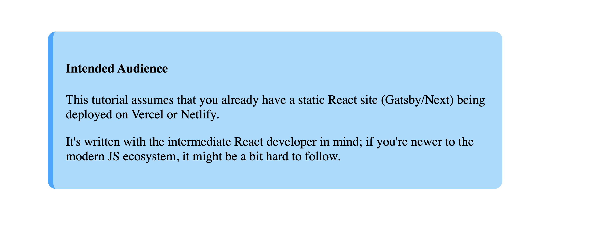

## Content

Intended Audience
This tutorial assumes that you already have a static React site (Gatsby/Next) being deployed on Vercel or Netlify.It's written with the intermediate React developer in mind; if you're newer to the modern JS ecosystem, it might be a bit hard to follow.

- ctr+ shift + P

- block Full weidth of the container. its called display block element.
- Inline element 

- blue ==>facebook, twitter nutral color
- red ==> danger,love,anger, tempt (netflix. zoomato)
- yellow ==> fun color

---
- negative space
- proximatry Realed things near by 
- Repeatation
- Contrast
- Alignment
- Focal Point (visual hierarchy) cta- call to access

- icon ==> every carv  is a maths value (svg ==> Scalable Vetctor Graphics)
- Grediant (svg does not support gradiant colour transformation) normal images
## Image Compressor tool
- Squoosh.app
- imagekit.io 

#### Topics Covered
- svg
- how to fast website (visit lighthouse)
- font awesome
- font awesome cdn --> to get link and paste head tag. then we use icon link

